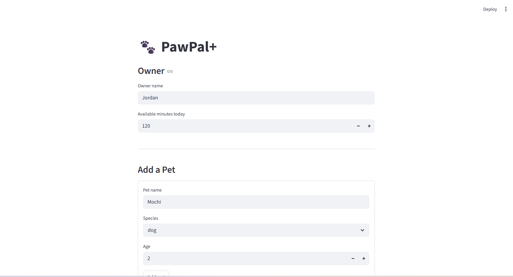

# PawPal+ (Module 2 Project)

**PawPal+** is a Streamlit app that helps a pet owner plan care tasks for their pet.

## Scenario

A busy pet owner needs help staying consistent with pet care. They want an assistant that can:

- Track pet care tasks (walks, feeding, meds, enrichment, grooming, etc.)
- Consider constraints (time available, priority, owner preferences)
- Produce a daily plan and explain why it chose that plan

This app helps with that aspect.

## Features

### Smart Daily Scheduling
Automatically builds a daily care plan from all your pets' pending tasks.
Tasks are selected using a greedy algorithm that fits as many tasks as
possible within the owner's available time budget. Tasks that would exceed
the remaining time are skipped, not dropped permanently.

### Priority-Based Task Sorting
Before scheduling, tasks are ranked by a three-level sort:
1. Owner-preferred categories come first (e.g. always prioritize "meds")
2. Then by priority level — high → medium → low
3. Then by shortest duration, to maximize how many tasks fit in the day

### Chronological Schedule Display
The final schedule is always presented in time order (HH:MM).
Tasks without a scheduled time are placed at the end as "flexible".

### Conflict Detection
After building the schedule, the system scans all timed tasks and flags
any pair where one task's end time overlaps the next task's start time.
Conflicts are shown in the UI with the exact time window of each task
and two fix options: auto-fix (shifts the second task to start right
after the first ends) or manual (owner sets their own new times).

### Recurring Tasks (Daily & Weekly)
Tasks can be set to repeat daily or on specific weekdays (e.g. Mon/Wed/Fri).
Each day, copies of applicable recurring tasks are injected into the schedule
automatically. When a recurring task is marked done, the next occurrence is
created with the correct due date — daily tasks roll to tomorrow, weekly tasks
find the nearest matching weekday.

### Task Filtering & Querying
Tasks across all pets can be filtered by:
- Pet name
- Completion status (done / pending)
- Priority level (high / medium / low)


---

## Getting started

### Setup

```bash
python -m venv .venv
source .venv/bin/activate  # Windows: .venv\Scripts\activate
pip install -r requirements.txt
```

## Smarter Scheduling

Several enhancements were added to make the scheduler more intelligent and maintainable:

**Recurring task auto-renewal** — When a `daily` or `weekly` task is marked complete, the scheduler automatically creates the next occurrence. Daily tasks get a new due date of today + 1 day (using `timedelta(days=1)`). Weekly tasks scan forward to find the nearest matching repeat day (e.g. Mon/Thu/Sat).

**Conflict detection** — `detect_conflicts()` scans all timed tasks chronologically and flags any pair where one task's end time overlaps the next task's start time. Warnings are printed without crashing the program.

**Single-pass sorting** — Task prioritization was simplified from two sequential sorts into one, using a combined key: owner preference category first, then priority level, then duration. A `prefs` set makes the preference check O(1).

**`Task.copy()`** — A `copy(**overrides)` method was added to `Task` so recurring task templates can be cloned cleanly with targeted field overrides, eliminating repeated field-by-field construction in two separate places.

**Cleaner removal** — `Pet.remove_task()` now returns a boolean, and `Scheduler.remove_task()` uses `any()` to short-circuit on the first successful removal instead of comparing list lengths before and after.

---

## Testing PawPal+

### Running the tests

```bash
python -m pytest tests/test_pawpal.py -v
```

### What the tests cover

| Test | What it verifies |
|---|---|
| `test_task_completion` | Calling `mark_done()` sets `is_done` to `True` |
| `test_task_addition` | Adding a task to a `Pet` increases its task count correctly; recurring tasks route to `recurring_tasks`, one-off tasks to `tasks` |
| `test_sort_by_time_chronological` | `sort_by_time()` returns tasks in ascending `HH:MM` order, with unscheduled tasks placed at the end |
| `test_daily_recurrence_spawns_next_day` | Marking a daily recurring task done automatically creates a new occurrence with a `due_date` of the following day |
| `test_conflict_detection_same_time` | Two tasks scheduled at the same time are detected and recorded as a conflict in the schedule |

### Confidence Level

★★★★☆ (4 / 5)

The core scheduling behaviors — priority sorting, time-budget greedy fit, recurring task injection, conflict detection, and task completion — are all implemented and tested. The bug in `Task.copy()` (duplicate keyword argument when passing overrides) was caught and fixed through testing. Confidence is held at 4 rather than 5 because there is currently no interactive UI for marking tasks done, auto-time-assignment does not exist (times must be set manually), and edge cases such as three-way time conflicts and weekly tasks with empty `repeat_days` are identified but not yet covered by tests.

---

### 📸 Demo

